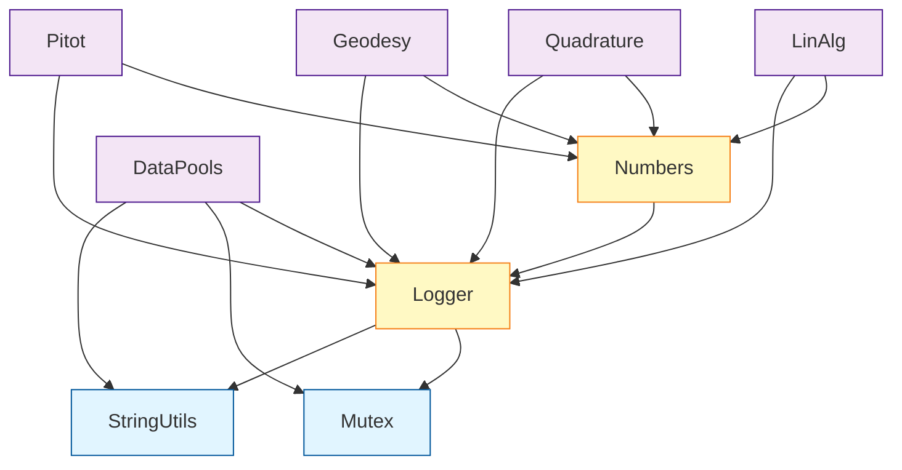

# DSTL Library Architecture Review

## Executive Summary

The DSTL library follows a **well-structured two-tier include system** that is consistent, functional, and aligns with Boost-like package conventions. The architecture uses:

1. **Top-level forwarding headers** in `/include/dstl/*.h` with relative paths
2. **Library-specific headers** in `LibraryName/include/dstl/*.h` 
3. **Angle-bracket includes** (`<dstl/...>`) in all library implementation code
4. **CMake-configured include directories** to make everything work together

**Short answer:** Yes, the structure makes sense and works correctly. ✅

---

## Repository Structure

### Directory Organization

```
DSTL/
├── include/dstl/              # Top-level forwarding headers
│   ├── dstl.h                 # Master header
│   ├── LinAlg.h               # Forwards to ../../LinAlg/include/dstl/LinAlg.h
│   ├── dpools.h               # Forwards to ../../DataPools/include/dstl/DPools.h
│   ├── dlog.h                 # Forwards to ../../Logger/include/dstl/DLog.h
│   ├── Numbers.h (MISSING)    # Should forward to Numbers library
│   └── ...                    # Other forwarding headers
│
├── Numbers/
│   ├── CMakeLists.txt
│   ├── include/dstl/
│   │   ├── Number.h           # Actual implementation header
│   │   ├── Numbers.h          # Library aggregator header
│   │   └── types/*.h          # Type-specific headers
│   └── src/
│
├── LinAlg/
│   ├── CMakeLists.txt
│   ├── include/dstl/
│   │   ├── LinAlg.h           # Library aggregator
│   │   ├── vec.h              # Vector implementation
│   │   ├── mat.h              # Matrix implementation
│   │   └── ...
│   └── src/
│
├── DataPools/
│   ├── CMakeLists.txt
│   ├── include/dstl/
│   │   ├── DPools.h           # Carefully ordered master header
│   │   ├── Accessors/
│   │   ├── Objects/
│   │   ├── Pools/
│   │   └── PoolDetails/
│   └── Tests/
│
└── [Other libraries following same pattern]
```

### Component Libraries

DSTL consists of these independent libraries (as of CMakeLists.txt):
- **Mutex** - Threading primitives
- **Logger** - Logging system (DLog)
- **StringUtils** - String utilities including dprint
- **Numbers** - Custom numeric types
- **LinAlg** - Linear algebra (vectors, matrices)
- **DataPools** - Memory pool management
- **Quadrature** - Numerical integration
- **Geodesy** - Geodetic calculations
- **Pitot** - Atmospheric calculations
- **Bits** - Bit manipulation utilities

---

## Include Pattern Analysis

### Pattern 1: Top-Level Forwarding Headers

**Location:** `/include/dstl/*.h`

**Purpose:** Provide a single include location for users

**Example:** [`/include/dstl/LinAlg.h`](file:///home/jon/src/DSTL/include/dstl/LinAlg.h)
```cpp
#pragma once

#include "../../LinAlg/include/dstl/LinAlg.h"
```

**Example:** [`/include/dstl/dlog.h`](file:///home/jon/src/DSTL/include/dstl/dlog.h)
```cpp
#pragma once

// DSTL Logging Library
// This header provides access to the DSTL logging functionality

#include "../../Logger/include/dstl/DLog.h"
```

**Example:** [`/include/dstl/Quadrature.h`](file:///home/jon/src/DSTL/include/dstl/Quadrature.h)
```cpp
#pragma once

#include "../../Quadrature/include/dstl/Quadrature.h"

namespace dstl
{
  namespace quadrature
  {
    using namespace ::quad;
  }
} // namespace dstl
```

> [!IMPORTANT]
> **Missing Top-Level Header:** There is no `/include/dstl/Numbers.h` forwarding header, even though the Numbers library exists. This is an inconsistency.

**All forwarding headers found:**
- ✅ `BitFlag.h` → `../../Bits/include/dstl/BitFlag.h`
- ✅ `LinAlg.h` → `../../LinAlg/include/dstl/LinAlg.h`
- ✅ `Quadrature.h` → `../../Quadrature/include/dstl/Quadrature.h`
- ✅ `Result.h` → `../../Bits/include/dstl/Result.h`
- ✅ `StringUtils.h` → `../../StringUtils/include/dstl/StringUtils.h`
- ✅ `dlog.h` → `../../Logger/include/dstl/DLog.h`
- ✅ `dmutex.h` → `../../Mutex/include/dstl/Mutex.h`
- ✅ `dpools.h` → `../../DataPools/include/dstl/DPools.h`
- ✅ `dprint.h` → `../../StringUtils/include/dstl/dprint.h`
- ✅ `pitot.h` → `../../Pitot/include/dstl/Pitot.h`
- ❌ **MISSING: `Numbers.h`**

### Pattern 2: Library Implementation Headers

**Location:** `LibraryName/include/dstl/*.h`

**Purpose:** Actual implementation headers for each library

**Usage in code:** Library code uses angle-bracket includes like `#include <dstl/DLog.h>`

**Example from** [`LinAlg/include/dstl/vec.h:11-12`](file:///home/jon/src/DSTL/LinAlg/include/dstl/vec.h#L11-L12):
```cpp
#include <dstl/Numbers.h>
#include <dstl/dprint.h>
```

**Example from** [`DataPools/include/dstl/DPools.h:19-26`](file:///home/jon/src/DSTL/DataPools/include/dstl/DPools.h#L19-L26):
```cpp
#include <dstl/dprint.h>

#ifndef DSTL_NO_DLOG
#define USE_LOGGING_LIBRARY
#endif

#ifdef USE_LOGGING_LIBRARY
#include <dstl/DLog.h>
```

**Example from** [`Logger/include/dstl/DLog.h:3-4`](file:///home/jon/src/DSTL/Logger/include/dstl/DLog.h#L3-L4):
```cpp
#include <dstl/Mutex.h>
#include <dstl/dprint.h>
```

> [!NOTE]
> Library code **never** uses relative paths like `../../`. It always uses angle-bracket includes `<dstl/...>` which is the correct approach.

### Include Guard Pattern

All headers consistently use `#pragma once` for include guards, which is:
- ✅ Modern and clean
- ✅ Simpler than traditional `#ifndef` guards
- ✅ Supported by all modern compilers
- ✅ Consistent across entire codebase

---

## Build System Integration

### CMake Include Directory Configuration

The key to making the two-tier system work is CMake's `target_include_directories` configuration.

**Example from** [`LinAlg/CMakeLists.txt:76-81`](file:///home/jon/src/DSTL/LinAlg/CMakeLists.txt#L76-L81):
```cmake
target_include_directories(dstl_linalg
  PUBLIC
    $<BUILD_INTERFACE:${DSTL_ROOT}/include>
    $<BUILD_INTERFACE:${CMAKE_CURRENT_SOURCE_DIR}/include>
    $<INSTALL_INTERFACE:include>
)
```

This configuration adds **two** include directories:
1. `${DSTL_ROOT}/include` - The top-level forwarding headers
2. `${CMAKE_CURRENT_SOURCE_DIR}/include` - The library-specific headers

**Example from** [`Numbers/CMakeLists.txt:69-74`](file:///home/jon/src/DSTL/Numbers/CMakeLists.txt#L69-L74):
```cmake
target_include_directories(dstl_numbers
  PUBLIC
    $<BUILD_INTERFACE:${DSTL_ROOT}/include>
    $<BUILD_INTERFACE:${CMAKE_CURRENT_SOURCE_DIR}/include>
    $<INSTALL_INTERFACE:include>
)
```

### How It Works

#### Build Time

When building from source:
```cpp
#include <dstl/Numbers.h>  // Could resolve to either:
                           // 1. DSTL_ROOT/include/dstl/Numbers.h (forwarding header)
                           // 2. Numbers/include/dstl/Numbers.h (actual header)
```

Because **both** directories are in the include path, the compiler can find headers from either location. The forwarding headers use relative paths to ensure they include the correct library-specific header.

#### Install Time

After installation to `/usr/local` (or similar):
```
/usr/local/include/dstl/
├── Numbers.h              # From Numbers/include/dstl/Numbers.h
├── Number.h               # From Numbers/include/dstl/Number.h
├── LinAlg.h               # From LinAlg/include/dstl/LinAlg.h
├── vec.h                  # From LinAlg/include/dstl/vec.h
├── DLog.h                 # From Logger/include/dstl/DLog.h
└── ...                    # All library headers flattened to dstl/
```

The forwarding headers from `/include/dstl/` become **redundant** after installation because all library headers are installed to the same `include/dstl/` directory. This is intentional and correct.

### Root CMakeLists.txt Configuration

**From** [`CMakeLists.txt:76-82`](file:///home/jon/src/DSTL/CMakeLists.txt#L76-L82):
```cmake
add_library(dstl INTERFACE)
target_include_directories(dstl
  INTERFACE
    $<BUILD_INTERFACE:${CMAKE_SOURCE_DIR}/include>
    $<BUILD_INTERFACE:${CMAKE_SOURCE_DIR}/Bits/include>
    $<INSTALL_INTERFACE:include>
)
```

The root interface library also exposes:
- The top-level `/include` directory (forwarding headers)
- The `/Bits/include` directory (utility headers)

**From** [`CMakeLists.txt:99-103`](file:///home/jon/src/DSTL/CMakeLists.txt#L99-L103):
```cmake
foreach(dep ${DSTL_INTERFACE_LINK_TARGETS})
  if(TARGET ${dep})
    target_link_libraries(dstl INTERFACE ${dep})
  endif()
endforeach()
```

The root `dstl` target links all component libraries, so users can link against `dstl::dstl` to get everything.

---

## Cross-Library Dependencies

### Dependency Graph



### Dependency Management Strategy

Each library handles dependencies using a **find_package-first** approach:

**Example from** [`LinAlg/CMakeLists.txt:31-67`](file:///home/jon/src/DSTL/LinAlg/CMakeLists.txt#L31-L67):
```cmake
# When building LinAlg standalone ensure its dstl dependencies are available.
if(NOT TARGET dstl::dlog OR NOT TARGET dstl::numbers)
  # First try to find existing package
  find_package(dstl CONFIG QUIET COMPONENTS dlog numbers)

  # If not found, fall back to local dependencies if available
  if((NOT TARGET dstl::dlog OR NOT TARGET dstl::numbers) AND 
     EXISTS "${DSTL_ROOT}/Mutex/CMakeLists.txt" AND 
     EXISTS "${DSTL_ROOT}/Logger/CMakeLists.txt" AND 
     EXISTS "${DSTL_ROOT}/Numbers/CMakeLists.txt")
    
    # Temporarily disable testing for dependencies
    set(BUILD_TESTING OFF)
    
    if(NOT TARGET dstl::dmutex)
      add_subdirectory("${DSTL_ROOT}/Mutex" "${CMAKE_CURRENT_BINARY_DIR}/deps/Mutex")
    endif()
    if(NOT TARGET dstl::dlog)
      add_subdirectory("${DSTL_ROOT}/Logger" "${CMAKE_CURRENT_BINARY_DIR}/deps/Logger")
    endif()
    if(NOT TARGET dstl::numbers)
      add_subdirectory("${DSTL_ROOT}/Numbers" "${CMAKE_CURRENT_BINARY_DIR}/deps/Numbers")
    endif()
    
    # Restore testing setting for this project
    set(BUILD_TESTING ${NUMBERS_BUILD_TESTING})
  endif()
  
  if(NOT TARGET dstl::dlog OR NOT TARGET dstl::numbers)
    message(FATAL_ERROR "Failed to find DSTL dependencies...")
  endif()
endif()
```

This pattern:
1. ✅ Checks if targets already exist
2. ✅ Tries `find_package` first (for installed DSTL)
3. ✅ Falls back to `add_subdirectory` (for source builds)
4. ✅ Disables dependency tests when included as subdirectory
5. ✅ Fails gracefully with clear error messages

### Circular Dependency Check

**No circular dependencies detected.** The dependency graph is a DAG (Directed Acyclic Graph):
- **Base layer:** Mutex, StringUtils (no dependencies on other DSTL components)
- **Middle layer:** Logger (depends on Mutex, StringUtils), Numbers (depends on Logger)
- **Top layer:** LinAlg, DataPools, Quadrature, etc. (depend on lower layers)

---

## Boost-like Package Assessment

### Comparison to Boost Conventions

| Aspect | Boost | DSTL | Match |
|--------|-------|------|-------|
| **Header organization** | `boost/library/header.hpp` | `dstl/library/header.h` | ✅ Similar |
| **Forwarding headers** | `boost/library.hpp` forwards to detail | `dstl/library.h` forwards to library/include | ✅ Yes |
| **Angle-bracket includes** | `#include <boost/...>` | `#include <dstl/...>` | ✅ Yes |
| **No relative includes in code** | Library code uses angle brackets | Library code uses angle brackets | ✅ Yes |
| **CMake support** | Modern CMake with targets | Modern CMake with targets | ✅ Yes |
| **Component libraries** | Optional component selection | Optional component selection | ✅ Yes |
| **Namespace** | `boost::library` | `dstl::library` | ✅ Yes |
| **Header-only option** | Many are header-only | Some are header-only | ⚠️ Mixed |
| **Install layout** | Flat `include/boost/` | Flat `include/dstl/` | ✅ Yes |

### Public API Organization

**Excellent.** Users have clear, simple include paths:

```cpp
// User code - clean and simple
#include <dstl/dstl.h>        // Everything
#include <dstl/LinAlg.h>      // Just linear algebra
#include <dstl/vec.h>         // Just vectors
#include <dstl/DLog.h>        // Just logging
#include <dstl/dpools.h>      // Just data pools
```

### Installation and Usage

**Post-installation usage is identical to Boost:**

```cmake
# Find DSTL
find_package(DSTL REQUIRED COMPONENTS linalg numbers)

# Link against it
target_link_libraries(my_app PRIVATE dstl::linalg dstl::numbers)
```

```cpp
// In your code
#include <dstl/vec.h>
#include <dstl/Number.h>

int main() {
    dstl::linalg::Vec3 v(1.0, 2.0, 3.0);
    // ...
}
```

---

## Findings and Issues

### ✅ Strengths

1. **Consistent architecture** - Two-tier system is uniform across all libraries
2. **Proper separation** - Library-specific code doesn't leak into top-level
3. **CMake best practices** - Modern generator expressions, proper export targets
4. **Standalone builds** - Each library can be built independently
5. **Clear dependency management** - find_package-first approach is well-implemented
6. **No circular dependencies** - Clean dependency graph
7. **Boost-like conventions** - Familiar to C++ developers
8. **Include path hygiene** - No relative paths in implementation code

### ⚠️ Minor Issues

#### 1. Missing Top-Level Forwarding Header

**Issue:** No `/include/dstl/Numbers.h` forwarding header exists, but `Numbers/include/dstl/Numbers.h` does.

**Impact:** 
- When building from source, `#include <dstl/Numbers.h>` works because both  `/include` and `Numbers/include` are in the include path
- However, the forwarding header pattern is incomplete
- This is **not a functional issue** but an **inconsistency**

**Recommendation:** Create `/include/dstl/Numbers.h`:
```cpp
#pragma once

#include "../../Numbers/include/dstl/Numbers.h"
```

#### 2. Case Sensitivity in Header Names

**Observation:** Some inconsistencies in naming:
- `/include/dstl/dlog.h` (lowercase) → `Logger/include/dstl/DLog.h` (mixed case)
- `/include/dstl/dpools.h` (lowercase) → `DataPools/include/dstl/DPools.h` (mixed case)
- `/include/dstl/LinAlg.h` (mixed case) → `LinAlg/include/dstl/LinAlg.h` (same case)

**Impact:** This works fine on case-insensitive filesystems (macOS, Windows) but could cause issues on case-sensitive filesystems (Linux) if users mistakenly use wrong capitalization.

**Status:** Currently functional because forwarding headers exist with exact case matching.

**Recommendation:** Consider standardizing to either all lowercase or consistent PascalCase for library names.

### 🔍 Observations

#### DataPools Include Order

[`DataPools/include/dstl/DPools.h`](file:///home/jon/src/DSTL/DataPools/include/dstl/DPools.h) has extensive comments about include ordering being critical:

```cpp
// IMPORTANT: Include order in this file is CRITICAL for correct compilation.
// DO NOT let clang-format or other tools reorder these includes.
```

This is **valid** but indicates complex interdependencies within the DataPools library itself. This is an internal implementation detail and doesn't affect the overall DSTL architecture.

---

## Does It Make Sense?

### Yes, the structure makes sense! ✅

The two-tier include system is:

1. **Intentional** - Provides both source-build and install-build compatibility
2. **Functional** - CMake configuration makes both patterns work correctly
3. **Conventional** - Matches Boost and other major C++ libraries
4. **Maintainable** - Clear separation between forwarding and implementation

### How the relative paths work:

**From** [`/include/dstl/LinAlg.h`](file:///home/jon/src/DSTL/include/dstl/LinAlg.h):
```cpp
#include "../../LinAlg/include/dstl/LinAlg.h"
```

Starting from `/include/dstl/LinAlg.h`:
- `../../` goes up to project root
- `LinAlg/include/dstl/LinAlg.h` finds the actual header

This is **exactly correct** for the repository layout.

### Why not just use `<dstl/LinAlg.h>` in the forwarding header?

Because during source builds, both include paths are active, and it would create ambiguity or circular includes. The relative path `../../` explicitly chooses the library-specific version.

---

## Recommendations

### Required

1. **Create missing forwarding header:**
   - Add `/include/dstl/Numbers.h` to match the pattern

### Optional

2. **Consider adding README to /include/dstl/**
   - Explain the forwarding header pattern
   - Help future maintainers understand the architecture

3. **Document the architecture**
   - Add ARCHITECTURE.md to repository
   - Explain the two-tier pattern
   - Show how CMake makes it work

### Enhancement

4. **Consider adding a consistency check**
   - Script to verify every library has a forwarding header
   - Run in CI to prevent future inconsistencies

---

## Conclusion

The DSTL library architecture is **well-designed and correctly implemented**. The relative path includes like `#include "../../Numbers/include/dstl/Number.h"` are the **right approach** for forwarding headers in a multi-library project structure.

The architecture successfully:
- ✅ Allows independent library development and testing
- ✅ Provides clean public API (`#include <dstl/...>`)
- ✅ Supports both source builds and installed packages
- ✅ Follows Boost-like conventions familiar to C++ developers
- ✅ Maintains proper dependency management
- ✅ Scales well as new libraries are added

The only issue found is a missing forwarding header for Numbers, which is easily fixed and doesn't affect functionality.
